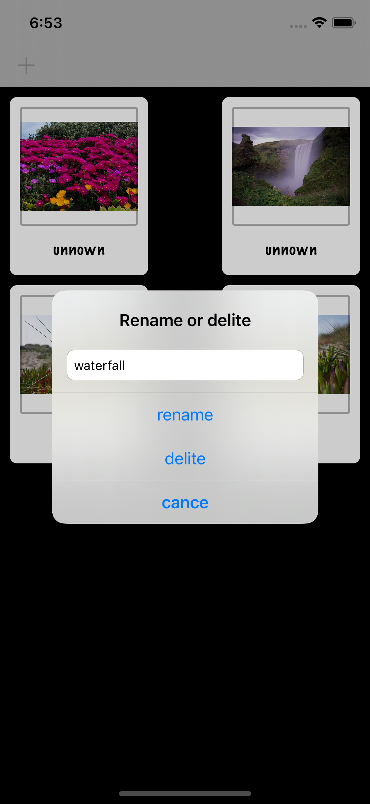
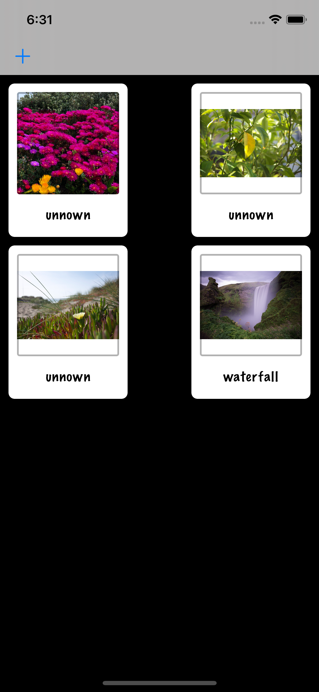

# NamesMemorizer
App designed to memorize names
## Tools implemented in project
- UICollectionView
- UICollectionViewCell
- UIImagePickerController
- Data 
- UUID
- fatalError()
- picker.sourceType = .camera
 ## Project Screen Shots

 
  
## Supported devices
iPhone 6S and 6S Plus.  
iPhone SE.  
iPhone 7 and 7 Plus.  
iPhone 8 and 8 Plus.  
iPhone X.  
iPhone XS, XS Max and XR.  
iPhone 11, 11 Pro and 11 Pro Max.  
## More features soon 
- sharing cells with friends
- new design
- changing position of rows
## Conclusion 
The project was tough, and it was challenging, there were parts when I didn't  even understand what's happening and why(  getDocumentsDirectory()).  
I'm finding this project helpful to understand basics of working with Collection view and view cells.  
Look forward to get back and make this app even better.     
